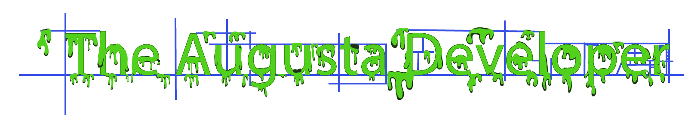

# [The Augusta Developer Website](https://augustadevs.github.io/)
### [The Augusta Devloper Organization](https://github.com/AugustaDevs)

# Lists
- [38 Great Resources for Game Developers](www.gamasutra.com/blogs/JasmineGreene/20170926/306446/38_Great_Resources_for_Game_Developers.php)
- [Ebook Foundation](https://github.com/EbookFoundation/free-programming-books)
- [Programming *expletive*](http://programming-motherfucker.com/)
- [Designer's List](https://www.designerslist.info/)
- [Creative Coding](https://github.com/terkelg/awesome-creative-coding)
- [Wireframes](http://wireframes.tumblr.com/)
- [Frontend Happy Hour Picks](https://github.com/FrontEndHappyHour/front-end-happy-hour-picks)
- [Everything Serverless](https://serverless.css-tricks.com/resources/)

# Tutorials
- [Colt Steele's Udemy Web Dev Bootcamp](https://www.udemy.com/the-web-developer-bootcamp/)
- [Mozilla's Web Dev Tutorials](https://developer.mozilla.org/en-US/docs/Learn)
- [Salesforce Trailhead](https://trailhead.salesforce.com/)
- [Project Based Tutorials](https://github.com/tuvtran/project-based-learning)
- [WebGL](https://webglfundamentals.org/)
- [Workshopper](https://github.com/workshopper)
- [Intro to React](https://reactjs.org/tutorial/tutorial.html)
- [Javascript30](https://javascript30.com/)
- [Google SEO](https://static.googleusercontent.com/media/www.google.com/en//webmasters/docs/search-engine-optimization-starter-guide.pdf)

# Veteran Tech Benefits
- [AWS Educate Now Available to U.S. Veterans | AWS Government, Education, & Nonprofits Blo](https://aws.amazon.com/blogs/publicsector/aws-educate-now-available-to-u-s-veterans/)
- [Free Sales force training for Vets](https://veterans.force.com/NewVetForceHome)
- [Linkedin for Vets](https://socialimpact.linkedin.com/programs/veterans/premiumform)

# Coding for Kids
- [bitsbox](https://bitsbox.com/)

# Web design inspiration
- [Brutalist Design](http://brutalistwebsites.com/)
- [Collect UI](https://medium.com/@CollectUI)

# Language Training
- [Exercism.io](http://exercism.io/)

# Cool Stuff
- [Experiments with Google](https://experiments.withgoogle.com/)

# Study Materials
  - [What is Code](https://www.bloomberg.com/graphics/2015-paul-ford-what-is-code/)

  - ## Javascript
    - [You Don't Know JS](https://github.com/getify/You-Dont-Know-JS)
    - [Learn Javascript](https://gitbookio.gitbooks.io/javascript/)
    - [JavaScript for Cats](https://noblemule.gitbooks.io/javascript-for-cats/content/)
    - [JavaScript Koans](https://github.com/mrdavidlaing/javascript-koans)
  - ## Computer Science
    - [Computer Science with Ruby](https://computer-science-one.gitbooks.io/cs101-book/content/)
    - [Algorithms](http://ressources.unisciel.fr/algoprog/s00aaroot/aa00module1/res/%5BCormen-AL2011%5DIntroduction_To_Algorithms-A3.pdf)
    - [Base CS](https://medium.com/basecs)

# Stay Up to Date
- [Hacker News](https://news.ycombinator.com/)
- [Smashing Magazine](https://www.smashingmagazine.com)
- [Front End Masters Handbook](https://frontendmasters.com/books/front-end-handbook/2018/)
- [Javascript Weekly](https://javascriptweekly.com/)
- [Frontend Focus](https://frontendfoc.us/)
- [Rand Fishkin at Moz](https://moz.com/community/users/63)

# Free
#### Design
- [Free Design Illustrations](https://www.lapa.ninja/blog/free-illustrations-library-for-your-project/)

#### Icons
- [Font Awesome Icons](https://fontawesome.com/icons?d=gallery)
- [Dev Icons](https://konpa.github.io/devicon/)

#### Ipsum

- [Hipster Ipsum](https://hipsum.co/)
- [Cloudinary Free Image Hosting](https://cloudinary.com/)
- [Easing](http://easings.net/)
- [Can I Use](https://caniuse.com/)

#### Images
- [Pexels Free Photos](https://www.pexels.com/)
- [Unsplash Free Photos](https://unsplash.com/)

## Web Dev
- [Reddit Programming](https://www.reddit.com/r/programming/)
- [codeburst.io](https://codeburst.io/)
- [Intro to Web Dev](http://www.internetfundamentals.com/)

## Cheat Sheets
- [Big O Cheatsheet](http://bigocheatsheet.com/)
- [emmet cheatsheet](https://docs.emmet.io/cheat-sheet/)

## Fonts and Typography
- [Google Fonts](https://fonts.google.com/)

## Source Control
- [Git Concepts not Syntax](https://dev.to/unseenwizzard/learn-git-concepts-not-commands-4gjc)
- [Git Immersion](http://gitimmersion.com)
- [Git - The Simple Guide](http://rogerdudler.github.io/git-guide/)
- [Learn Git Branching](https://learngitbranching.js.org)
- [Git Branching Strategy](http://nvie.com/posts/a-successful-git-branching-model/)

## Serverless
- [Codepen and Firebase](https://blog.codepen.io/2018/01/15/build-serverless-blog-codepen/)

# Documentation for the web
  - [MDN Web Docs](https://developer.mozilla.org/en-US/)
    - [all HTML elements](https://developer.mozilla.org/en-US/docs/Web/HTML/Element)
    - [all HTML attributes](https://developer.mozilla.org/en-US/docs/Web/HTML/Attributes)
    - [CSS Reference](https://developer.mozilla.org/en-US/docs/Web/CSS/Reference)
  - [Google's Web Fundamentals](https://developers.google.com/web/fundamentals/)
  - [All W3C Standards and Drafts](https://www.w3.org/TR/)
  - [RFCs](https://www.ietf.org/standards/rfcs/)
  
# Performance
- ### Tools
  - [PageSpeed Insights from Google](https://developers.google.com/speed/pagespeed/insights/)
  - [Mobile-friendly Test from Google](https://search.google.com/test/mobile-friendly?utm_source=mft&utm_medium=redirect&utm_campaign=mft-redirect)
# Web Security
- ### Guides
  - [Awesome Reference Guide from Mozzilla's Infosec Team](https://infosec.mozilla.org/guidelines/web_security.html)
- ### Tutorials
  - [Let's Encrypt Tutorials](https://www.digitalocean.com/community/tags/let-s-encrypt?type=tutorials)
- ### Tools
  - [Observatory by Mozzilla (free security scan for your domain)]()
  - [Add-on from Mozzilla for Automating a Secure Content Security Policy](https://addons.mozilla.org/en-US/firefox/addon/laboratory-by-mozilla/)
  - [Mozilla SSL Configuration Generator](https://mozilla.github.io/server-side-tls/ssl-config-generator/)

# Languages/Language Features

#### GraphQL
- [GraphQL for FE Devs](https://css-tricks.com/front-end-developers-guide-graphql/)

#### SQL
- [MySQL CLI Cheat Sheet](https://gist.github.com/hofmannsven/9164408)

#### ES6
- [ES6 Cheat Sheet](http://es6-features.org/)

#### NodeJS
- [Preventing SQLI with Node](https://blog.hailstone.io/how-to-prevent-sql-injection-nodejs/)
- [Node JS Testing Intro](https://hackernoon.com/a-crash-course-on-testing-with-node-js-6c7428d3da02)

#### CSS
- ###### CSS Grid
  - [CSS Grid 12 Column layout](https://erikmonjas.github.io/css-grid-12-column-layout/)
  - [cssgr.id: An Interactive CSS Grid Code Tool and Generator](https://cssgr.id/)
- ###### Flexbox
  - [The Power of Flex-Grow](https://hackernoon.com/the-power-of-flex-grow-d8ea61ccf16e)
  - [A Complete Guide to Flexbox](https://css-tricks.com/snippets/css/a-guide-to-flexbox/)
  - [Flexbox Froggy](https://flexboxfroggy.com/)
- ###### Selectors
  - [Css Selectors Reference (W3Schools)](http://www.w3schools.com/cssref/css_selectors.asp)
  - [How CSS Selectors Work (CSS-Tricks)](https://css-tricks.com/how-css-selectors-work/)
  - [CSS Selectors reference (WebPlatform)](https://docs.webplatform.org/wiki/css/selectors)
- ###### Tools
  - [Box Shadow](https://www.cssmatic.com/box-shadow)
  - [Clip Path](https://bennettfeely.com/clippy/)

###### Misc
- [Radial Gradient Recipes](https://css-tricks.com/radial-gradient-recipes/)

---

# Interview Prep
- [How to Present a Github Project to a future employer](https://thehftguy.com/2016/10/24/heres-how-to-make-a-good-github-project-for-your-resume/)

### Misc
- [Solved With CSS! Dropdown Menus ](https://css-tricks.com/solved-with-css-dropdown-menus/)
- [10 Signs You will Suck at Programming ](https://blog.usejournal.com/10-signs-you-will-suck-at-programming-5497a6a52c5c)
- [API Design](https://opensource.zalando.com/restful-api-guidelines/)

